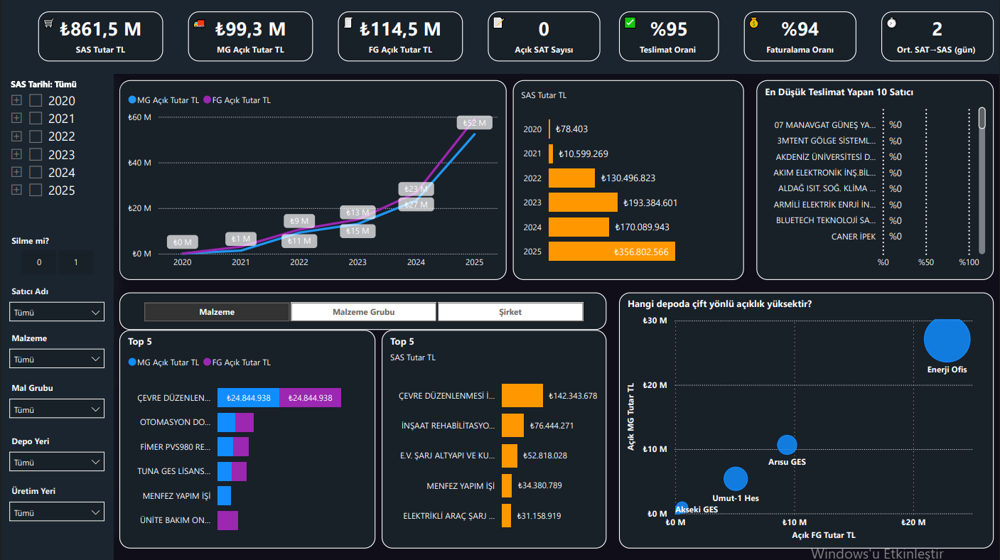
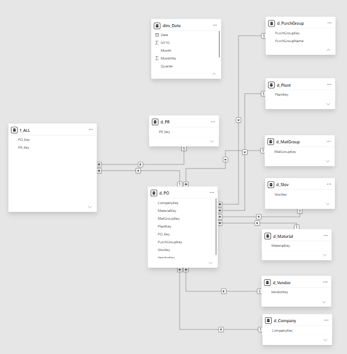
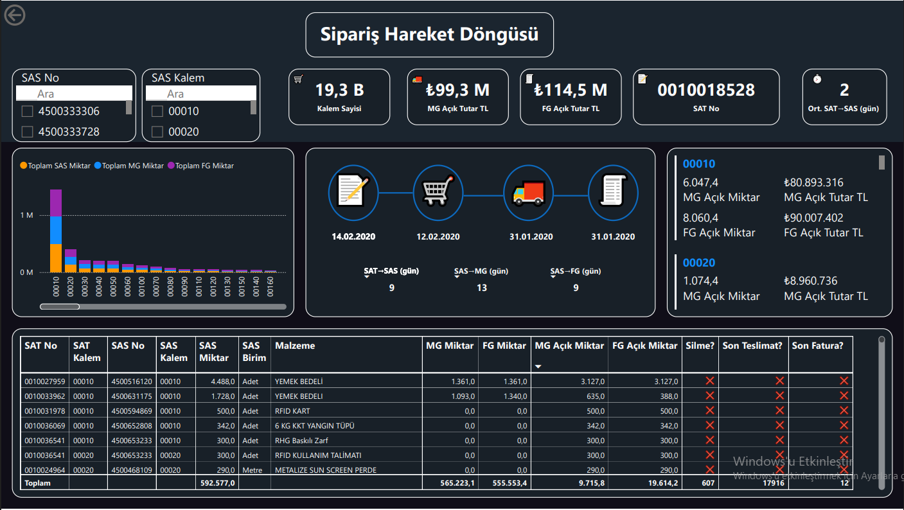

# SAP Satın Alma Süreç Analizi — Power BI Dashboard

<p align="center">
  
</p>

SAP HANA üzerinden çekilen satın alma verilerini (SAT → SAS → Mal Girişi → Fatura döngüsü) Star Schema veri modeliyle yapılandırıp, uçtan uca süreç görünürlüğü sağlayan Power BI raporu.

---

## İş Problemi

Satın alma süreci (Satın Alma Talebi → Satın Alma Siparişi → Mal Girişi → Fatura) çok adımlı ve farklı SAP modüllerine (MM, FI) yayılmış durumdadır. Bu nedenle aşağıdaki soruların yanıtlanması zorlaşmaktadır:

- Hangi siparişlerde teslimat veya faturalama gecikmesi yaşanıyor?
- Hangi tedarikçi ve depolarda performans sorunları bulunuyor?
- Henüz teslim alınmamış veya faturalanmamış açık sipariş tutarı ne kadar?

---

## Veri Mimarisi

SAP HANA Studio üzerinden SAT, SAS, MIGO ve MIRO verileri Python ile batch olarak alınmış, ardından Power BI tarafında Star Schema veri modeli oluşturulmuştur.

### Star Schema Yapısı

```text
                    dim_Date
                       │
   d_PurchGroup ───┐   │   ┌─── d_Plant
                    │   │   │
   d_MatGroup  ─────┤   │   ├───── d_Slov
                    │   │   │
                      f_ALL
                    │   │   │
   d_Material ──────┤   │   ├───── d_Vendor
                    │   │   │
   d_PR        ─────┘   │   └───── d_Company
                       d_PO
```

Merkezde bulunan **f_ALL** fact tablosu, **PO_Key** ve **PR_Key** anahtarları üzerinden tüm boyut tablolarına bağlanmaktadır. Bu yapı sayesinde tedarikçi, malzeme grubu, satın alma grubu, şirket ve depo bazında yüksek performanslı analizler gerçekleştirilebilmektedir.

### Power BI Semantik Modeli

<p align="center">
  
</p>

---

## Dashboard Özellikleri

### Genel Bakış Sayfası

- Toplam SAS, Mal Girişi ve Fatura tutarları
- Teslimat ve faturalama oranları
- Yıllara göre açık sipariş tutarı trendi
- En düşük teslimat performansına sahip tedarikçiler
- Malzeme, Malzeme Grubu ve Şirket bazında Top 5 analizleri
- Depo bazlı açık sipariş analizi

### Dashboard Görünümü

<p align="center">
  
</p>

---

### Sipariş Hareket Döngüsü

- Sipariş bazında SAT → SAS → Mal Girişi → Fatura süreci
- Sipariş kalemi seviyesinde açık miktar ve tutar takibi
- SAT→SAS, SAS→MG ve SAS→FG süre analizleri (gün bazında)

<p align="center">
  
</p>

---

## Kullanılan Teknolojiler

| Katman | Teknoloji |
|---------|-----------|
| Veri Kaynağı | SAP HANA |
| ETL | Python |
| Veri Modeli | Star Schema |
| Veri Tabanı | SAP HANA |
| Görselleştirme | Power BI |
| Analiz | DAX |

---

## İş Değeri

- SAP BW gibi yüksek maliyetli raporlama çözümlerine olan ihtiyacın azaltılmasına katkı sağlandı.
- Satın alma sürecindeki gecikme noktaları (SAT→SAS, SAS→MG, SAS→FG) görünür hale getirildi.
- Tedarikçi, depo ve şirket bazında performans karşılaştırmaları tek ekranda yapılabilir hale getirildi.
- Karar vericilerin satın alma süreçlerini daha hızlı analiz edebilmesi sağlandı.

---

> **Not:** Bu projede kullanılan tedarikçi isimleri, şirket bilgileri ve finansal veriler gizlilik nedeniyle anonimleştirilmiştir. Veri modeli, ETL yaklaşımı ve analiz mantığı gerçek projeyle birebir aynıdır.

---


Yazar
Kaan Uysal
